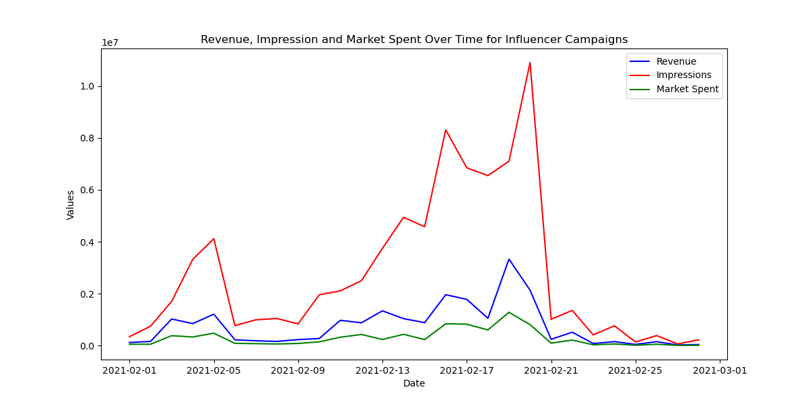

# Digital Marketing Metrics Analytics
 Unlocking marketing strategy performance through measuring digial marketing metrics using Python.
## This is a draft model for analyzing the effectiveness of influencer compaigns

### Linear Regression Analysis
- Linear Regression models can understand how the value of one variable changes with respect to others.
- For analyzing influencer data, this method is used to explore how well predictors like impressions, clicks, and marketing spend explain the variance in revenue.

_**Result**_
- R-squared (0.904): Indicates that approximately 90.4% of the variability in revenue is explained by the model. 
- Impressions: It's statistically significant (p = 0.037), indicating a reliable effect at conventional significance levels.
- Marketing Spent: not statistically significant (p = 0.091). This might suggest inefficient spending or a saturation of returns on investment in marketing.
- Clicks: not statistically significant (p = 0.127). This might indicate potential benefits from clicks, but not strong enough to be reliably detected in this model.
- **Leads: Very strong positive effect (1677.4588) and highly significant (p = 0.000). This suggests that leads are a strong driver of revenue in this dataset.**

## Dataset Overview
 This digital marketing dataset is from [Kaggle](https://www.kaggle.com/datasets/sinderpreet/analyze-the-marketing-spending/data)
 The marketing CSV file contains data on various campaigns and their performance metrics. It includes columns such as:
 - id: Unique identifier for each entry
 - c_date: Date of the campaign
 - campaign_name: Name of the campaign
 - category: Category of the campaign (e.g., social, search, influencer, media)
 - campaign_id: Unique identifier for each campaign
 - impressions: Number of impressions generated by the campaign
 - mark_spent: Amount spent on the campaign
 - clicks: Number of clicks received
 - leads: Number of leads generated
 - orders: Number of orders made
 - revenue: Revenue generated from the campaign
   

