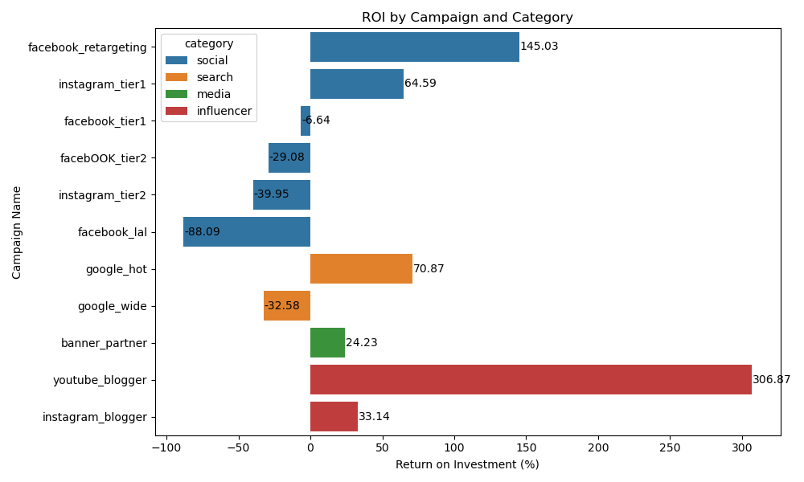
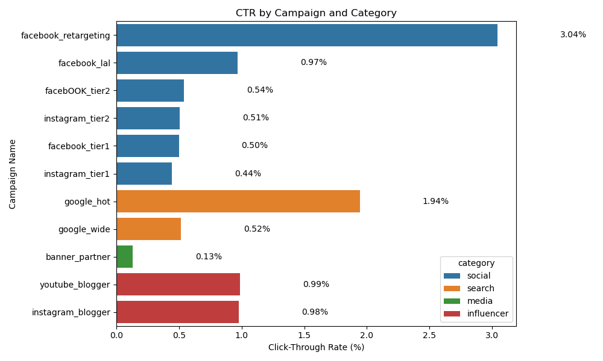
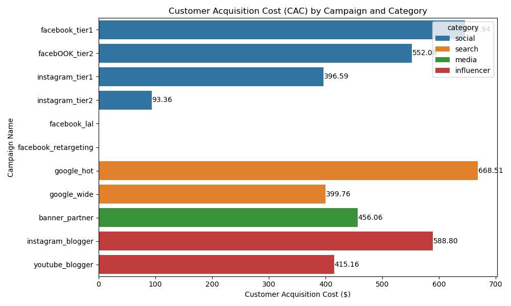
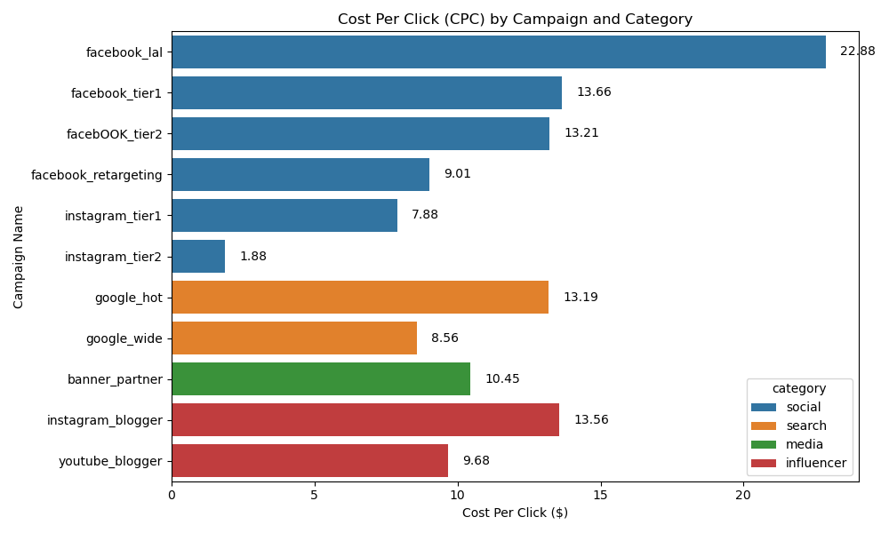
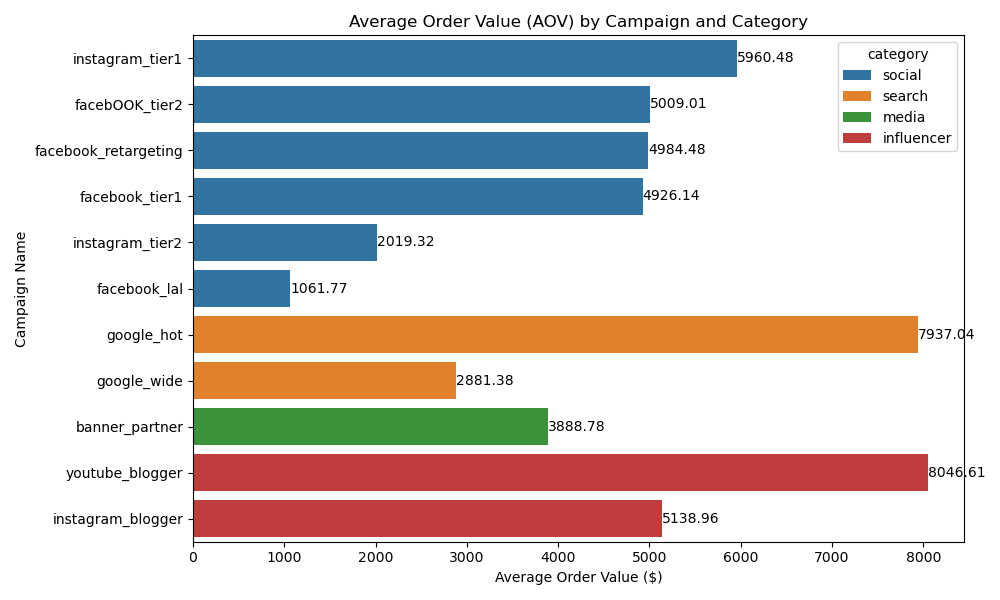
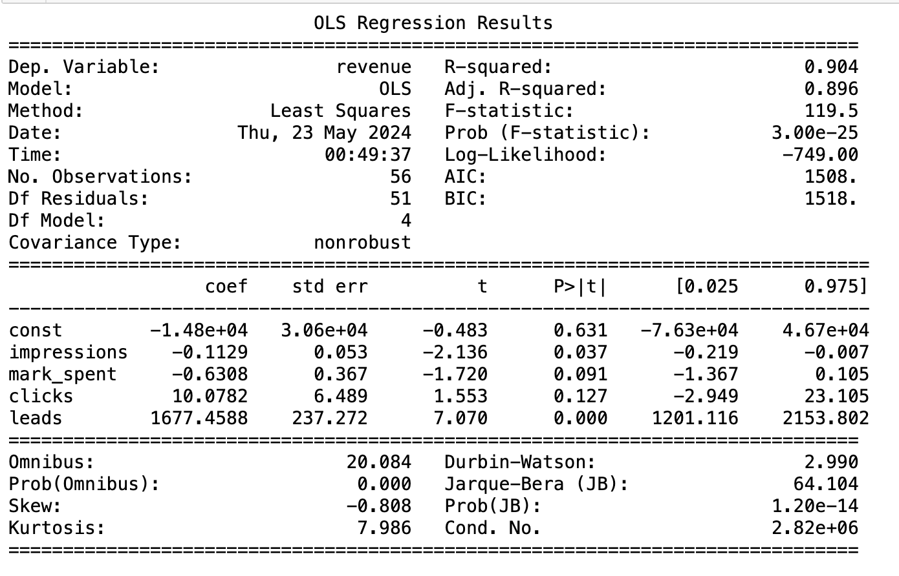

# Digital Marketing Metrics Analytics
 Unlocking marketing strategy performance through measuring digial marketing metrics using Python.
 
## My draft thought process for analyzing the effectiveness of influencer compaigns specifically for this project and this data set
1. Define key metrics to use to evaluate the performance of each campaigns, such as ROI, click-through rate (CTR), cost per click (CPC), customer acquisition cost (CAC), and average order on value (AOV)
2. Visualize data by category and campaigns
   
   
   
   
   
4. Look into the influencer category and see which campaign performs well based on the key metrics mentioned above
5. Dig into other factors that might affect the campaign through a more thorough analytics tool platform to derive more related data for analysis (due to data constraints, I can't perform any method for this step)

### Linear Regression Analysis - Statistical approach (WIP)
1. Conducted statistical models to see the relationship between each predictor and revenue (dependent variable)
2. Got an overview of which variable is statiscally important to dig into more key metrics related to the variable

- Linear Regression models can understand how the value of one variable changes with respect to others.
- For analyzing influencer data, this method is used to explore how well predictors like impressions, clicks, and marketing spend explain the variance in revenue.

_**Result**_
- R-squared (0.904): Indicates that approximately 90.4% of the variability in revenue is explained by the model. 
- Impressions: It's statistically significant (p = 0.037), indicating a reliable effect at conventional significance levels.
- Marketing Spent: not statistically significant (p = 0.091). This might suggest inefficient spending or a saturation of returns on investment in marketing.
- Clicks: not statistically significant (p = 0.127). This might indicate potential benefits from clicks, but not strong enough to be reliably detected in this model.
- **Leads: Very strong positive effect (1677.4588) and highly significant (p = 0.000). This suggests that leads are a strong driver of revenue in this dataset.**

## Dataset Overview
 This digital marketing dataset is from [Kaggle](https://www.kaggle.com/datasets/sinderpreet/analyze-the-marketing-spending/data)
 The marketing CSV file contains data on various campaigns and their performance metrics. It includes columns such as:
 - id: Unique identifier for each entry
 - c_date: Date of the campaign
 - campaign_name: Name of the campaign
 - category: Category of the campaign (e.g., social, search, influencer, media)
 - campaign_id: Unique identifier for each campaign
 - impressions: Number of impressions generated by the campaign
 - mark_spent: Amount spent on the campaign
 - clicks: Number of clicks received
 - leads: Number of leads generated
 - orders: Number of orders made
 - revenue: Revenue generated from the campaign
   

